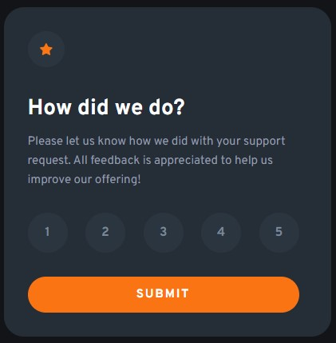

# Frontend Mentor - Interactive rating component solution

This is a solution to the [Interactive rating component challenge on Frontend Mentor](https://www.frontendmentor.io/challenges/interactive-rating-component-koxpeBUmI). Frontend Mentor challenges help you improve your coding skills by building realistic projects.

## Table of contents

- [Overview](#overview)
  - [The challenge](#the-challenge)
  - [Screenshot](#screenshot)
  - [Links](#links)
- [My process](#my-process)
  - [Built with](#built-with)
  - [Useful resources](#useful-resources)
- [Author](#author)

## Overview

### The challenge

Users should be able to:

- View the optimal layout for the app depending on their device's screen size
- See hover states for all interactive elements on the page
- Select and submit a number rating
- See the "Thank you" card state after submitting a rating

### Screenshot

### Links

- Solution URL: [Frontend Mentor]()
- Live Site URL: [Interactive Rating Component]()

## My process

### Built with

- Semantic HTML5 Markup
- CSS Flexbox
- CSS Custom Properties
- JavaScript

### Useful resources

- [PerfectPixel](https://chrome.google.com/webstore/detail/perfectpixel-by-welldonec/dkaagdgjmgdmbnecmcefdhjekcoceebi) - This Chrome Extension helped me to make the project similiar to the design.

## Author

- Website - [Cagri Kizilkan](https://cagrikizilkan.com)
- Frontend Mentor - [@cgrkzlkn](https://www.frontendmentor.io/profile/cgrkzlkn)
- Twitter - [@cgrkzlkn](https://www.twitter.com/cgrkzlkn)
